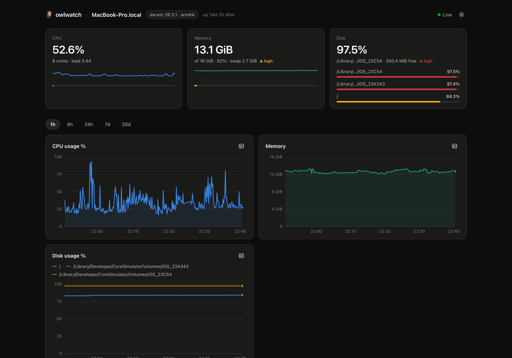
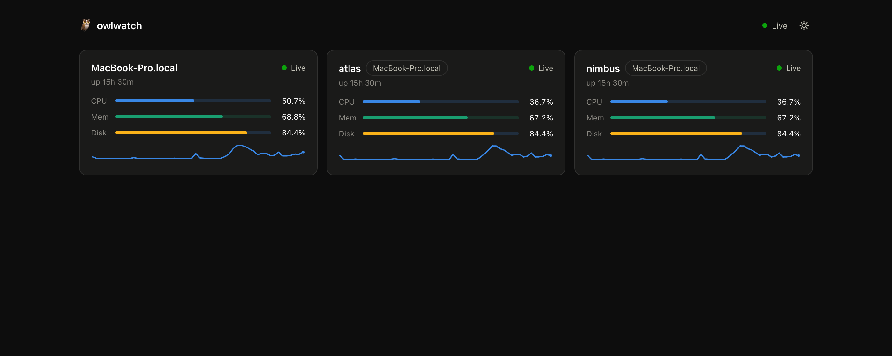

# 🦉 owlwatch

**Single-container host monitoring with a beautiful web UI.** One static Go
binary serves an embedded React dashboard showing **CPU, GPU, RAM and disk** —
live (updated every 2 seconds over SSE) and over time (SQLite history, 1 hour
to 30 days). No agents, no external database, no config files.

[](https://github.com/CleveroAB/owlwatch/actions/workflows/ci.yml)
[](https://github.com/CleveroAB/owlwatch/actions/workflows/codeql.yml)
[](https://github.com/CleveroAB/owlwatch/releases/latest)
[](https://opensource.org/licenses/MIT)



*Dark is the default theme; here is the same dashboard in the
[light theme](docs/screenshot-light.png).*

## Security and exposure

> [!WARNING]
> **owlwatch has no TLS, and no authentication unless you set
> `OWLWATCH_TOKEN`** (see
> [Monitoring multiple servers](#monitoring-multiple-servers-federation)).
> Without a token, anyone who can reach the port can see everything the
> dashboard shows; with one, the token still travels in plain text. Run it on
> a trusted LAN, over a VPN such as Tailscale, or behind a reverse proxy that
> terminates TLS (nginx or Caddy work fine). Do not expose it directly to the
> internet. It is read-only — metrics out, nothing in — but treat host
> telemetry as sensitive anyway.

For an internet-reachable deployment, generate a strong token with
`openssl rand -base64 32`, then follow the tested [Caddy, nginx, or Tailscale
recipes](docs/deployment.md). Security vulnerabilities should be reported
privately according to [SECURITY.md](SECURITY.md).

## Quick start

### From a clone

```sh
git clone https://github.com/CleveroAB/owlwatch.git
cd owlwatch
docker compose up -d
```

Open <http://localhost:8080>. That's it.

If host port 8080 is taken, override the published port without editing the
file: `OWLWATCH_HOST_PORT=7676 docker compose up -d` (or set
`OWLWATCH_HOST_PORT` in your platform's environment settings — Coolify,
Portainer, etc.). The port *inside* the container stays 8080.

### Prebuilt image

No clone needed — images are published to GitHub Container Registry by CI.
Use `latest` for the newest stable release, pin `1.0`/`1.0.0` in controlled
environments, or use `edge` to test the current `main` branch:

```sh
docker run -d --name owlwatch \
  -p 127.0.0.1:8080:8080 \
  --restart unless-stopped \
  --read-only --cap-drop ALL --security-opt no-new-privileges \
  --tmpfs /tmp \
  -e HOST_PROC=/host/proc \
  -e HOST_SYS=/host/sys \
  -e HOST_ETC=/host/etc \
  -e OWLWATCH_ROOTFS=/host/rootfs \
  -v /proc:/host/proc:ro \
  -v /sys:/host/sys:ro \
  -v /etc:/host/etc:ro \
  -v /:/host/rootfs:ro,rslave \
  -v owlwatch-data:/data \
  ghcr.io/cleveroab/owlwatch:latest
```

Versioned native Linux binaries for amd64 and arm64 are attached to every
[GitHub release](https://github.com/CleveroAB/owlwatch/releases). They run the
same headless server and embedded web UI without Docker; owlwatch is not a
desktop application. Containers remain the recommended installation because
the supplied mounts make the host boundary explicit and reproducible.

### Why all those mounts?

Both commands bind-mount a few host paths read-only so the numbers describe
the **host**, not the container:

| Mount | Why |
|---|---|
| `/proc` → `/host/proc` | host CPU, memory, load, mount table |
| `/sys` → `/host/sys` | host sensors and system info |
| `/etc` → `/host/etc` | host OS identification (`os-release` etc., via gopsutil's `HOST_ETC`) |
| `/` → `/host/rootfs` | disk usage measured against host filesystems; host hostname (read from `/host/rootfs/etc/hostname`, since the container only sees its own UTS hostname) |
| `owlwatch-data` volume → `/data` | SQLite history (survives restarts; delete the volume to reset) |

The rootfs mount uses `ro,rslave` (the same pattern node_exporter documents):
with the default private propagation, filesystems mounted on the host *after*
the container starts would not appear inside it, and their disk usage would
silently be read from the empty mountpoint directory underneath.

The service runs as the distroless `nonroot` user with a read-only root
filesystem, no Linux capabilities, and `no-new-privileges`. Only the persistent
`/data` volume and temporary `/tmp` filesystem are writable. Standard Linux
host metrics remain readable through the supplied read-only bind mounts.

Host monitoring is supported on **Linux hosts**. Docker Desktop on macOS or
Windows would monitor Docker's Linux VM rather than the physical machine and
is therefore not a supported deployment target.

## Monitoring multiple servers (federation)

One owlwatch can watch many. Every instance runs the **same image** and stays
a fully working standalone dashboard; setting `OWLWATCH_PEERS` on one of them
turns it into a **hub** that connects to each peer's normal API and serves an
overview of the whole fleet plus a full per-server dashboard.

 Peers need no
new configuration, and there is no central metric storage — history stays on
each server (the hub proxies history queries on demand), so a hub restart
loses nothing.

### Example: two servers plus a hub

Deploy owlwatch on each machine exactly as in the quick start. Then pick one
instance as the hub — one of the monitored servers or a third machine — and
give it two extra environment variables:

```yaml
    environment:
      # ...the quick-start variables, plus:
      OWLWATCH_PEERS: web1=https://web1.example.com|WEB1_TOKEN,db1=https://db1.example.com|DB1_TOKEN
      OWLWATCH_TOKEN: HUB_TOKEN
```

Open the hub's port and you get an overview grid with a live card per server;
click a card for that server's full dashboard, history charts included.

The hub itself may appear in its own `OWLWATCH_PEERS` (handy when one list is
shared across the fleet): it recognizes itself — same hostname and boot time —
and shows the machine once, under the name you gave it.

Peer **names** (`web1`, `db1` above) are the display names and, lowercased,
the server IDs: letters, digits and dashes, up to 32 characters, unique, and
not the reserved words `local` or `overview`. Peer **URLs** must be absolute
`http`/`https` with no path (redirects are not followed). An invalid
`OWLWATCH_PEERS` is a fatal startup error rather than a silently ignored one.

### Access tokens

Set a different strong `OWLWATCH_TOKEN` on each internet-reachable instance.
Give the hub each peer's token in that peer's `name=url|token` entry. The hub's own token can remain distinct. When a token is set:

- every `/api/*` route requires an `Authorization: Bearer` header and answers
  `401` without it;
- the hub authenticates to each peer with that peer's configured token;
- the dashboard asks you for the token once (it is kept in the browser's
  localStorage and attached to every request);
- `/healthz` is not under `/api` and stays open, so the Docker `HEALTHCHECK`
  keeps working. The static UI shell is also public — the pages load, the
  data behind them doesn't.

Append each peer's token with
`name=url|token`:

```
OWLWATCH_PEERS=web1=https://web1.example.com|WEB1_TOKEN,db1=https://db1.example.com|DB1_TOKEN
```

A token protects the API but is no substitute for TLS — the warning at the
top of this README still applies.

### Coolify (and similar platforms)

Deploy the same owlwatch resource on every server. On the instance you pick
as the hub, add the two environment variables from the example above. And
since the hub is typically reached through a domain name, remember to set
`OWLWATCH_ALLOWED_HOSTS` to that domain (see
[Configuration](#configuration)) — unknown Host headers are rejected
with `421`.

## GPU support (NVIDIA only in v1)

owlwatch reads GPU utilization, VRAM, temperature and power by polling
`nvidia-smi`. Inside the container that binary comes from the
[NVIDIA Container Toolkit](https://docs.nvidia.com/datacenter/cloud-native/container-toolkit/latest/install-guide.html),
which injects it — along with the driver libraries — at container start.

1. Install the NVIDIA driver and `nvidia-container-toolkit` on the host.
2. Uncomment `gpus: all` in `docker-compose.yml` (or add `--gpus all` to
   `docker run`).

No GPU, no problem: the GPU tile and chart simply don't render, and nothing
is polled. AMD, Intel and Apple GPUs are not supported in v1.

## Configuration

Everything is environment variables; the defaults are sensible.

| Variable | Default | Meaning |
|---|---|---|
| `OWLWATCH_LISTEN` | `127.0.0.1` | HTTP listen address; the image uses `0.0.0.0` internally while Compose publishes only to host loopback |
| `OWLWATCH_PORT` | `8080` | HTTP listen port |
| `OWLWATCH_DB` | `./data/owlwatch.db` | SQLite path (the Docker image sets `/data/owlwatch.db`) |
| `OWLWATCH_SAMPLE_INTERVAL` | `2s` | live sampling cadence (Go duration syntax) |
| `OWLWATCH_PERSIST_INTERVAL` | `10s` | how often a sample is written to history |
| `OWLWATCH_RETENTION_DAYS` | `30` | history retention (pruned hourly) |
| `OWLWATCH_ROOTFS` | *(empty)* | container mode: path where the host `/` is bind-mounted (e.g. `/host/rootfs`); empty = native mode |
| `OWLWATCH_ALLOWED_HOSTS` | *(empty)* | extra Host-header names to accept (comma-separated). IP-literal hosts and `localhost` are always accepted; other names are rejected with 421 to block DNS rebinding |
| `OWLWATCH_PEERS` | *(empty)* | comma-separated `name=url\|token` pairs, e.g. `web1=https://web1.example.com\|WEB1_TOKEN`. Each token authenticates the hub to that peer; setting this makes the instance a [hub](#monitoring-multiple-servers-federation) |
| `OWLWATCH_TOKEN` | *(empty)* | every `/api/*` route requires `Authorization: Bearer` when set (`/healthz` stays open); minimum 16 characters. Also used as the fallback outgoing peer token when an entry omits its own token |
| `OWLWATCH_MAX_SSE_CLIENTS` | `128` | maximum concurrent live-stream clients |
| `OWLWATCH_MAX_HISTORY_REQUESTS` | `16` | maximum concurrent history requests |
| `HOST_PROC`, `HOST_SYS`, `HOST_ETC`, `HOST_VAR`, `HOST_RUN` | *(unset)* | standard [gopsutil](https://github.com/shirou/gopsutil) redirects; docker-compose sets the first three |

### URL parameters

The dashboard theme normally follows the toggle in the header (persisted to
localStorage) or, before the first toggle, the OS preference. A
`?theme=dark|light` query parameter overrides both for that page load without
persisting anything — handy for deep links, kiosk displays and screenshots:

```
http://localhost:8080/?theme=light
```

## Local development

Requirements: Go 1.25+ and Node 22+.

The Go binary embeds the compiled frontend via `go:embed`, and `web/dist` is
gitignored — so **the frontend must be built before any Go build** or the
embed directive fails. The Makefile encodes that order:

```sh
make build   # npm ci + vite build, then go build → ./owlwatch
make run     # make build, then run it on 127.0.0.1:8080
```

For UI iteration, run the two dev servers side by side:

```sh
# Terminal 1 — backend on :8080
go run ./cmd/owlwatch

# Terminal 2 — frontend dev server on :5173, /api proxied to :8080
cd web && npm run dev
```

Iterate on the UI at <http://localhost:5173> with hot reload; the Vite proxy
forwards `/api` (including the SSE stream) to the Go backend. Production host
monitoring and official release artifacts target Linux.

## API

All JSON. The exact shapes live in
[`internal/metrics/types.go`](internal/metrics/types.go) and
[`internal/metrics/federation.go`](internal/metrics/federation.go), with
their mirror in [`web/src/lib/types.ts`](web/src/lib/types.ts). When
`OWLWATCH_TOKEN` is set, every `/api/*` route requires the token
with an `Authorization: Bearer` header — `/healthz` never does.

| Endpoint | Returns |
|---|---|
| `GET /api/servers` | `ServerSummary[]` — every monitored server: the local one first (id `local`), then peers in configured order, each with id, name, online status, last-seen time and latest sample |
| `GET /api/servers/{id}/host` | static host identity: hostname, platform, kernel, CPU model, cores, total memory, boot time, GPU names, owlwatch version. `404` unknown id, `502` if the peer has never been reached |
| `GET /api/servers/{id}/live` | SSE stream — one `hello` event on connect (`{host, recent, intervalMs}` with the last ~5 min of samples and the sample interval), then a `snapshot` event per sample (every 2 s by default); comment heartbeat every 15 s |
| `GET /api/servers/{id}/history?range=1h\|6h\|24h\|7d\|30d` | `{range, points}` — server-side bucketed aggregates (≤ ~400 points per response); proxied from the peer for peer ids. Unknown range → `400`, unknown id → `404`, unreachable peer → `502` |
| `GET /api/overview/live` | SSE stream for the whole fleet — a `servers` event on connect (full `ServerSummary[]`), then `snapshot` events (`{id, snapshot}`) for every server and `status` events (`{id, online, lastSeen}`) on peer transitions |
| `GET /healthz` | `200 ok` while the latest sample is fresh (within 5× the sample interval), `503` before the first sample or when sampling has stalled; drives the Docker `HEALTHCHECK` |

The unprefixed v1 endpoints — `GET /api/host`, `GET /api/live`,
`GET /api/history` — remain as aliases for the local server. That alias
surface is what a hub consumes on its peers, so it is frozen: older and newer
instances federate cleanly.

## Architecture

```
┌────────────────────────── docker container ──────────────────────────┐
│  owlwatch (single static Go binary)                                  │
│                                                                      │
│  collector ──2s ticks──▶ broadcast ──▶ SSE hub ──▶ GET /api/live     │
│   (gopsutil,             │                                           │
│    nvidia-smi)           └──every 10s──▶ store (SQLite @ /data)      │
│                                             │                        │
│  embedded web/dist (go:embed) ◀── React UI  └──▶ GET /api/history    │
└──────────────────────────────────────────────────────────────────────┘
```

- **Live path** — the collector samples every 2 s into a ring buffer (last
  5 min) and broadcasts each snapshot to SSE subscribers. Slow clients are
  dropped rather than allowed to block the sampler.
- **History path** — every 10 s one sample is written to SQLite
  (pure-Go driver, WAL mode). Queries aggregate into time buckets server-side;
  data older than the retention window is pruned hourly.
- **One artifact** — the React UI is compiled to static files and embedded in
  the Go binary; the final image is distroless (glibc but no shell), roughly
  the size of the binary itself.

The full design — package contracts, wire formats, schema, UI spec — lives in
[DESIGN.md](DESIGN.md).

## Support and contributing

- Read [Troubleshooting](docs/troubleshooting.md) for common deployment,
  federation, GPU, history, and proxy problems.
- Ask usage questions in [GitHub
  Discussions](https://github.com/CleveroAB/owlwatch/discussions).
- Report reproducible defects or focused feature requests with the repository's
  issue forms.
- Read [CONTRIBUTING.md](CONTRIBUTING.md), [GOVERNANCE.md](GOVERNANCE.md),
  and the [Code of Conduct](CODE_OF_CONDUCT.md) before opening a pull request.
- Report vulnerabilities privately as described in [SECURITY.md](SECURITY.md).
- See [CHANGELOG.md](CHANGELOG.md) for release history and [SUPPORT.md](SUPPORT.md)
  for the support scope.

## License

MIT © [Clevero AB](https://clevero.se).
